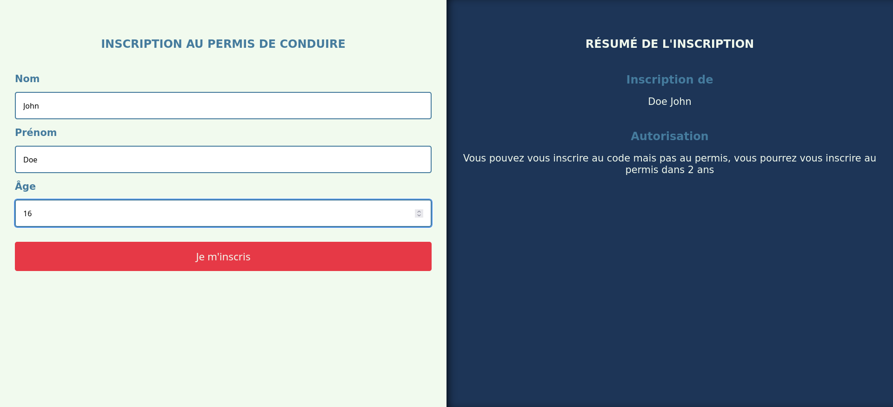
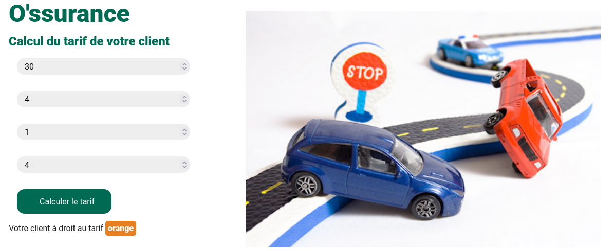

# Permis / Assurances AT2 - CP7 : Develop the back-end part of a web or mobile web application.

The objective of this exercise is to create logic behind an application and to dynamize the elements according to the results obtained.

## Built with

1. PHP
2. CSS

## Result

### Permis

### Assurances

These exercises was designed by the O'clock school.
